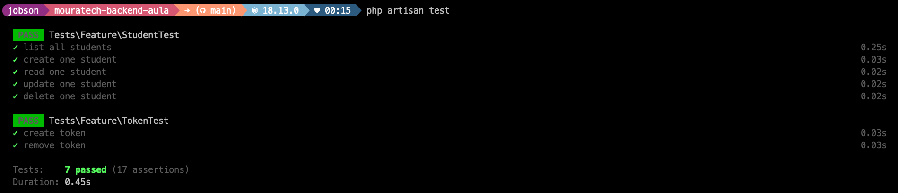
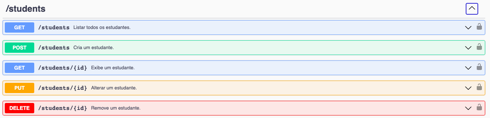

     
    

## API

API desenvolvida usando o framework [Laravel](https://laravel.com/) para demosntrações em sala de aula de como consumir uma API em uma SPA construída com [React](https://pt-br.reactjs.org/).

**OBSERVAÇÃO:** Os dados da API não são reais e foram gerados usando a biblioteca [FakerPHP/Faker](https://fakerphp.github.io/).

     

     

